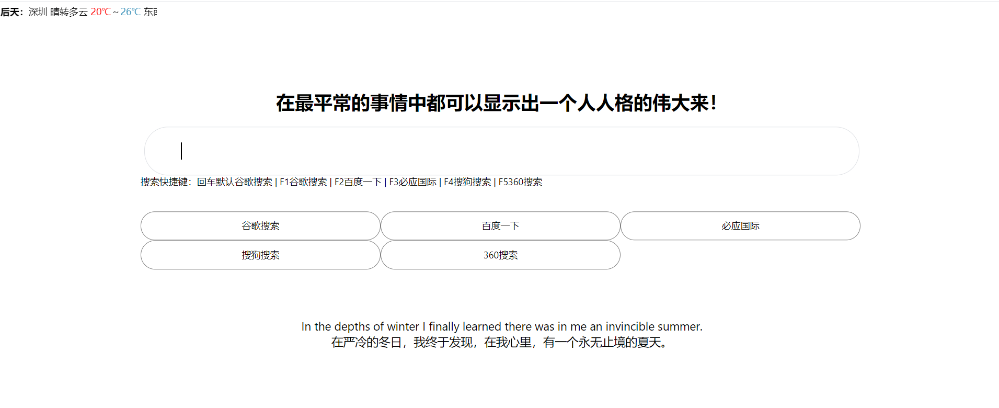

# 谷歌浏览器新建标签页改版
在办公室可以访问谷歌、在家里访问不到谷歌
在家每次打开浏览器要查询信息都要重新输入百度地址、有点麻烦
搞一个综合快捷键的搜索集合
接入hitokoto每日一句、
接入爱词霸的每日一句英文

# 更新
2021-03-24 加入天气组件

## 安装
```
1、谷歌浏览器输入：`chrome://extensions/`
2、点击开启开发者模式
3、点击加载已解压的扩展程序、导入该项目地址
```

## 预览
